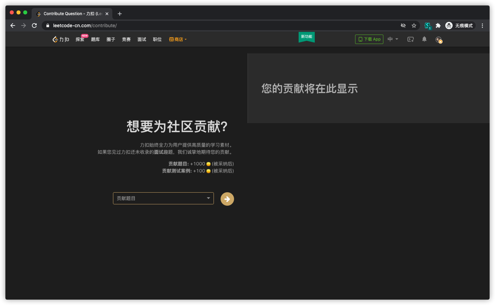

<h1 align="center">LeetCodeCN-Dark</h1>

> 中国区 LeetCode 支持黑色主题。

## 目录

- [目录](#目录)
- [前言](#前言)
- [安装](#安装)
  - [安装 Stylus 或 xStylus](#安装-stylus-或-xstylus)
  - [安装 LeetCodeCN-Dark](#安装-leetcodecn-dark)
- [样式支持](#样式支持)
- [代码贡献](#代码贡献)

## 前言

LeetCode 估计最近是在样式迁移，很多页面还不支持黑色主题，从一个页面跳转另一个页面经常样式不统一让人蛋疼。为了解决我和你的强迫症，我写了这个项目。

如果后续 LeetCode 官方迁移完了，我会渐进的去除样式。

## 安装

### 安装 Stylus 或 xStylus

样式覆盖需要 [Stylus](https://chrome.google.com/webstore/detail/stylus/clngdbkpkpeebahjckkjfobafhncgmne) 或 [xStylus](https://chrome.google.com/webstore/detail/xstyle/hncgkmhphmncjohllpoleelnibpmccpj) 浏览器插件支持，因此你需要先安装他们。

> [具体安装方式请参考](https://github.com/openstyles/stylus/wiki/Usercss#how-do-i-install-usercss)

### 安装 LeetCodeCN-Dark

[点击这里，立即安装样式](https://raw.githubusercontent.com/blackcater/LeetCodeCN-Dark/master/leetcode-cn-dark.user.css)。（前提是你已经安装了上步说的浏览器插件）

## 样式支持

<a href="https://leetcode-cn.com/">未登录样式（❌官方已支持）</a>

<a href="https://leetcode-cn.com/">主页（❌官方已支持）</a>

<a href="https://leetcode-cn.com/problemset/all/">问题列表页</a>

<a href="https://leetcode-cn.com/contest/">竞赛页面</a>

<a href="https://leetcode-cn.com/list/">收藏页面</a>

<a href="https://leetcode-cn.com/notes/">笔记本页面</a>

<a href="https://leetcode-cn.com/playground/">Playground 页面</a>

<a href="https://leetcode-cn.com/points/">积分页面</a>

<a href="https://leetcode-cn.com/session/">进度管理页面</a>

<a href="https://leetcode-cn.com/store/">商城页面</a>

<a href="https://leetcode-cn.com/contribute/">社区贡献页面</a>

## 代码贡献

我无法覆盖到所有页面，也无法覆盖到所有浏览器。如果样式运行在你的浏览器上有问题，请一定要[告知我](https://github.com/blackcater/LeetCodeCN-Dark/issues/new)！

不过，最好是你可以给我提交 PR，非常感谢！

---

